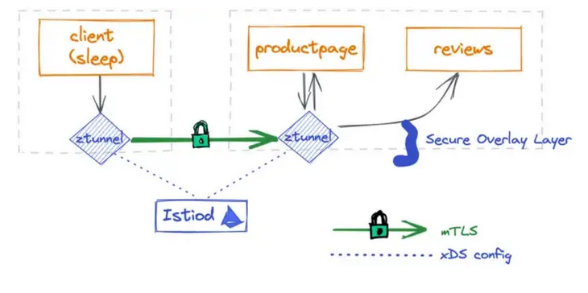
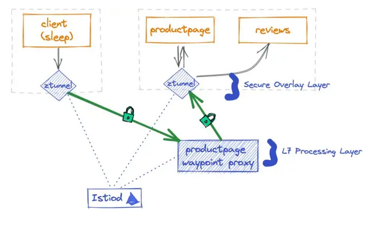

# Kubernetes ambient service mesh with Istio tutorial
> Note: This tutorial is based on kind running on an ubuntu 20.04 machine with docker. 
> It should work on any other linux distribution. We also tried to run it on a 
> macbook pro with docker desktop, this did not work yet. To see the current status 
> of all supported environments please look [here](https://github.com/istio/istio/tree/experimental-ambient#supported-environments).

This is a tutorial for the istio service mesh in ambient mode. In this 
tutorial we want to show two use cases with the use of istio ambient:

* ### L4 and L7 network processing layer with istio ambient
* ### Deploying kiali dashboard addon on istio ambient

## Requirements
* kubectl
* kind: with a local cluster running with configuration similiar to:
   ```bash
   kind create cluster --config=- <<EOF
   kind: Cluster
   apiVersion: kind.x-k8s.io/v1alpha4
   name: ambient
   nodes:
   - role: control-plane
   - role: worker
   - role: worker
   EOF
   ```
* docker

## Getting started
To get started with the tutorial, follow the following steps:

### Installation

1. Download the experimental version of istioctl 
    ```bash
    curl https://storage.googleapis.com/istio-build/dev/0.0.0-ambient.191fe680b52c1754ee72a06b3e0d3f9d116f2e82/istio-0.0.0-ambient.191fe680b52c1754ee72a06b3e0d3f9d116f2e82-linux-amd64.tar.gz --output istio.tar.gz
    ```
2. untar the file
    ```bash
    tar -xvf istio.tar.gz
    rm istio.tar.gz
    ```
3. Move the istioctl binary to the istio folder
    ```bash
    mkdir istio
    mv istio*/*  istio
    ```
4. Install instio in ambient mode on your local cluster
    ```bash
    ./istio/bin/istioctl install --set profile=ambient -y
    ```
    You should see the following output:
    ```bash
    ✔ Istio core installed
    ✔ Istiod installed
    ✔ Ingress gateways installed
    ✔ CNI installed
    ✔ Installation complete
    ```
5. You can also see all the istio resources with the following command:
    ```bash
    kubectl -n istio-system get all
    ```
    You should see output along the line of:
    ```bash
    NAME                                       READY   STATUS    RESTARTS   AGE
    pod/istio-cni-node-5vkb6                   1/1     Running   0          12m
    pod/istio-cni-node-tc8fn                   1/1     Running   0          12m
    pod/istio-cni-node-zm8dl                   1/1     Running   0          12m
    pod/istio-ingressgateway-dd667dbb7-z64jh   1/1     Running   0          12m
    pod/istiod-6f9c757686-kw5z4                1/1     Running   0          14m
    pod/ztunnel-5qpn7                          1/1     Running   0          14m
    pod/ztunnel-fccxw                          1/1     Running   0          14m
    pod/ztunnel-mq72n                          1/1     Running   0          14m
   
    NAME                           TYPE           CLUSTER-IP     EXTERNAL-IP   PORT(S)                                      AGE
    service/istio-ingressgateway   LoadBalancer   10.96.15.172   <pending>     15021:32651/TCP,80:32654/TCP,443:30106/TCP   12m
    service/istiod                 ClusterIP      10.96.83.33    <none>        15010/TCP,15012/TCP,443/TCP,15014/TCP        14m
   
    NAME                            DESIRED   CURRENT   READY   UP-TO-DATE   AVAILABLE   NODE SELECTOR            AGE
    daemonset.apps/istio-cni-node   3         3         3       3            3           kubernetes.io/os=linux   12m
    daemonset.apps/ztunnel          3         3         3       3            3           <none>                   14m
   
    NAME                                   READY   UP-TO-DATE   AVAILABLE   AGE
    deployment.apps/istio-ingressgateway   1/1     1            1           12m
    deployment.apps/istiod                 1/1     1            1           14m
   
    NAME                                             DESIRED   CURRENT   READY   AGE
    replicaset.apps/istio-ingressgateway-dd667dbb7   1         1         1       12m
    replicaset.apps/istiod-6f9c757686                1         1         1       14m
   
    NAME                                                       REFERENCE                         TARGETS         MINPODS   MAXPODS   REPLICAS   AGE
    horizontalpodautoscaler.autoscaling/istio-ingressgateway   Deployment/istio-ingressgateway   <unknown>/80%   1         5         1          12m
    horizontalpodautoscaler.autoscaling/istiod                 Deployment/istiod                 <unknown>/80%   1         5         1          14m
    ```
    In the output you can see the 3 "ambient" proxies running, one for each node in the cluster. 
    ```bash
    pod/istio-cni-node-5vkb6                   1/1     Running   0          12m
    pod/istio-cni-node-tc8fn                   1/1     Running   0          12m
    pod/istio-cni-node-zm8dl                   1/1     Running   0          12m
    ```
    If you compare this to a service mesh that is not running in ambient mode, 
    you will see that there are no proxy nodes running. Then only a proxy is installed when a pod is deployed. In 
    such a setup only the following resources are created:
    ```bash
    pod/istio-egressgateway-5bdd756dfd-2f9cq    1/1     Running   0          82s
    pod/istio-ingressgateway-67f7b5f88d-qf8vq   1/1     Running   0          82s
    pod/istiod-58c6454c57-bvv4v                 1/1     Running   0          94s
    ```
### Deploying the demo apps

1. Apply all the deployments found in the istio samples folder
   > You need to wait until all pods are running, otherwise we can't label the 
   > pods in step 2.  
   ```bash
   kubectl apply -f ./istio/samples/bookinfo/platform/kube/bookinfo.yaml
   kubectl apply -f ./istio/samples/bookinfo/networking/bookinfo-gateway.yaml
   kubectl apply -f https://raw.githubusercontent.com/linsun/sample-apps/main/sleep/sleep.yaml
   kubectl apply -f https://raw.githubusercontent.com/linsun/sample-apps/main/sleep/notsleep.yaml
   ```

2. Put all the apps in ambient mode
   ```bash
   kubectl label namespace default istio.io/dataplane-mode=ambient
   ```
   
3. If deployments are correct you should be able to see one of the node "ambient" proxies logs:
   ```bash
   kubectl logs <istio-cni-node-id> -n istio-system|grep route
   ```
   You should see output along the line of:
   ```bash
   2022-11-26T19:44:13.500330Z     info    ambient Adding route for productpage-v1-7c548b785b-thqvj/default: [table 100 10.244.2.9/32 via 192.168.126.2 dev istioin src 10.244.2.1]
   2022-11-26T19:44:13.507981Z     info    ambient Adding route for details-v1-76778d6644-fnqpt/default: [table 100 10.244.2.4/32 via 192.168.126.2 dev istioin src 10.244.2.1]
   2022-11-26T19:44:13.513244Z     info    ambient Adding route for ratings-v1-85c74b6cb4-njpsd/default: [table 100 10.244.2.5/32 via 192.168.126.2 dev istioin src 10.244.2.1]
   2022-11-26T19:44:13.519424Z     info    ambient Adding route for reviews-v1-6494d87c7b-vl9qf/default: [table 100 10.244.2.6/32 via 192.168.126.2 dev istioin src 10.244.2.1]
   2022-11-26T19:44:13.525845Z     info    ambient Adding route for reviews-v2-79857b95b-nkqcz/default: [table 100 10.244.2.7/32 via 192.168.126.2 dev istioin src 10.244.2.1]
   2022-11-26T19:44:13.531266Z     info    ambient Adding route for reviews-v3-75f494fccb-27bj5/default: [table 100 10.244.2.8/32 via 192.168.126.2 dev istioin src 10.244.2.1]
   ```
   
### L4 processing in ambient mode
Istio service mesh ambient supports L4 processing by default. This means
that traffic only goes through the ztunnel and not a waypoint proxy, as shown in the figure below.

We can verify this by using our sleep application to communicate to other 
services within our cluster.

1. Call the product page service from within our sleep application with curl.
   ```bash
   kubectl exec deploy/sleep -- curl -s http://productpage:9080/
   ```
   > We use curl to call the productpage service and to retrieve the index 
   > page.

2. Check the logs of the ztunnels that are in the same node as the product page and sleep service.
   > Note: this requires some trial and error, because we don't know which 
   > ztunnel belongs to a specific node.
   ```bash
   kubectl  -n istio-system logs <ztunnel_id> -cistio-proxy --tail 1
   ```
   You should see in the ztunnel dedicated to the productpage service output similiar:
   ```bash
   [2022-11-29T19:43:56.477Z] "- - HTTP/2" 0 - - - "-" 241 1968 91918 - "-" "-" "-" "-" "-" - - 10.244.2.4:15008 10.244.1.2:39660 - - capture inbound listener
   ```
   You should see in the ztunnel dedicated to the sleep service output similiar to:
   ```bash
   [2022-11-29T19:43:56.476Z] "- - -" 0 - - - "-" 84 1839 32 - "-" "-" "-" "-" "envoy://outbound_tunnel_lis_spiffe://cluster.local/ns/default/sa/sleep/10.244.2.4:9080" spiffe://cluster.local/ns/default/sa/sleep_to_http_productpage.default.svc.cluster.local_outbound_internal envoy://internal_client_address/ 10.96.33.162:9080 10.244.1.4:51650 - - capture outbound (no waypoint proxy)
   ```

### L7 processing in ambient mode
To enable l7 processing, you must deploy a gateway. A gateway will make
sure that the communication between the two services is secure.
This setup can be seen in the picture below.


You can install the gateway with the following commands:

1. Deploy a gateway with the following definition:   
   > Note that the gatewayClassName in the gateway resource must be set 
   > to ‘istio-mesh’, otherwise Istio won’t create the corresponding 
   > waypoint proxy for the productpage.
   ```bash
   kubectl apply -f - <<EOF
   apiVersion: gateway.networking.k8s.io/v1alpha2
   kind: Gateway
   metadata:
    name: productpage
    annotations:
      istio.io/service-account: bookinfo-productpage
   spec:
    gatewayClassName: istio-mesh
   EOF
   ```
2. You can check if the deployment of the productpage waypoint was successfull 
   by running the following command:
   ```bash
   kubectl get pod | grep waypoint
   ```
   Your output should be similiar to:
   ```bash
   bookinfo-productpage-waypoint-proxy-fcf74c55d-j9zm5   1/1     Running   0          27s
   ```
   
3. Call the product page service from within our sleep application with curl.
   ```bash
   kubectl exec deploy/sleep -- curl -s http://productpage:9080/
   ```
   > We use curl to call the productpage service and to retrieve the index 
   > page.

4. Check the logs of the ztunnels that are in the same node as the product page and sleep service.
   > Note: this requires some trial and error, because we don't know which 
   > ztunnel belongs to a specific node.
   ```bash
   kubectl  -n istio-system logs <ztunnel_id> -cistio-proxy --tail 1
   ```
   You should see in the ztunnel dedicated to the productpage service output similiar:
   ```bash
   [2022-11-29T20:18:40.054Z] "- - HTTP/2" 0 - - - "-" 865 1977 90640 - "-" "-" "-" "-" "-" - - 10.244.2.4:15008 10.244.1.11:37182 - - capture inbound listener
   ```
   You should see in the ztunnel dedicated to the sleep service output similiar to:
   ```bash
   [2022-11-29T20:18:40.046Z] "- - -" 0 - - - "-" 84 1894 43 - "-" "-" "-" "-" "10.244.1.11:15006" spiffe://cluster.local/ns/default/sa/sleep_to_server_waypoint_proxy_spiffe://cluster.local/ns/default/sa/bookinfo-productpage 10.244.1.4:36849 10.96.33.162:9080 10.244.1.4:51652 - - capture outbound (to server waypoint proxy)
   ```
   If you look at the ztunnel dedicated to the sleep service, you can read that the 
   request will first go to a server waypoint proxy just as shown in the picture above.

### Installing a service mesh addon

#### Kiali dashboard 
> Note: ambient mode can cause issues with kiali

To deploy kiali dashboard on ambient mode, you can go to you istio installation
en install the plugim. You can do this by running the following commands.

1. Install the kiali dashboard by running the following command:
   ```bash
   kubectl apply -f ./istio/samples/addons
   kubectl rollout status deployment/kiali -n istio-system
   ```
2. Access the dashboard kiali dashboard in your browser by running the following command:
   ```bash
   ./istio/bin/istioctl dashboard kiali
   ```
   > It could be that the graph does not show anything. This means that your cluster 
   > did not handle any request in the past minute. Follow the next step to make
   > the traffic flow visible.
   In your graph view you can see an overview of all your services on the cluster and how 
   traffic flows between services.

3. Call the productpage service with your sleep service
   ```bash
   kubectl exec deploy/sleep -- curl -s http://productpage:9080/
   ```
   
4. Go back to your graph dashboard and see the traffic flow similiar to the picture below:


